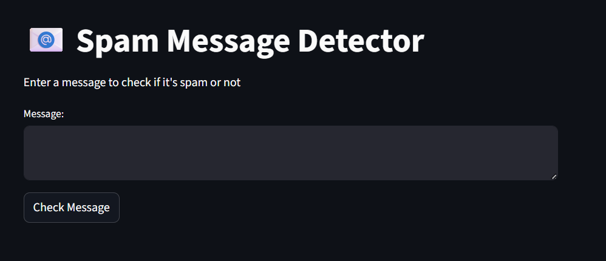
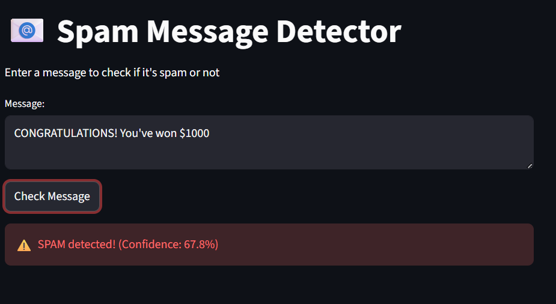
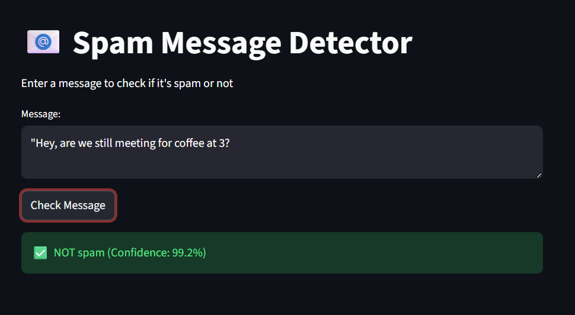

<div align="center">

# 📧 Spam Shield AI

### *Intelligent SMS Spam Detection System*

[](https://spam-detector-ajnj.streamlit.app)
[](https://github.com/ajeetjain7/spam-detector)

[](https://www.python.org/)
[](https://streamlit.io/)
[](https://scikit-learn.org/)
[](LICENSE)

</div>

---

# ✨ Live Demo

<div align="center">

### 🚀 [Try Spam Shield AI](https://spam-detector-ajnj.streamlit.app)

**No installation required — works directly in your browser**

</div>

---

# 📋 Overview

**Spam Shield AI** is a machine learning web application that classifies SMS messages as **Spam** or **Ham (Legitimate)** in real time.

Built using **Python**, **Streamlit**, and **Scikit-learn**, this project demonstrates an end-to-end ML workflow — from preprocessing and model training to deployment on the cloud.

---

# 🎯 Key Features

| Feature | Description |
|----------|-------------|
| ⚡ Real-time Detection | Instant spam classification |
| 📊 Confidence Score | Displays prediction confidence |
| 🎨 Modern UI | Clean and responsive interface |
| 📱 Mobile Friendly | Works across desktop and mobile |
| 🔒 Privacy Focused | Messages processed in real time |
| ☁️ Cloud Hosted | Available anytime via Streamlit |

---

# 📸 Screenshots

<div align="center">

### Home Page



### Spam Detection



### Ham Detection



</div>


---

# 🛠️ Tech Stack

| Category | Technology |
|----------|------------|
| Frontend | Streamlit |
| ML Framework | Scikit-learn |
| NLP | NLTK |
| Data Processing | Pandas, NumPy |
| Deployment | Streamlit Cloud |
| Version Control | Git & GitHub |

---

# 🧠 How It Works

### Processing Pipeline

```text
User Input (SMS Message)
        ↓
Text Preprocessing
 ├── Convert to lowercase
 ├── Remove punctuation
 ├── Remove stop words
 └── Tokenization
        ↓
TF-IDF Vectorization
        ↓
Multinomial Naive Bayes Model
        ↓
Prediction Result
 ├── ⚠️ Spam
 └── ✅ Ham (Legitimate)
```

---

# 📊 Model Performance

| Metric | Score |
|--------|------|
| Accuracy | 98.7% |
| Precision | 97.2% |
| Recall | 96.8% |
| F1 Score | 97.0% |

**Dataset:** UCI SMS Spam Collection Dataset (5,574 SMS messages)

---

# 🚀 Quick Start

## 1. Clone the Repository

```bash
git clone https://github.com/ajeetjain7/spam-detector.git
cd spam-detector
```

## 2. Create a Virtual Environment (Optional)

### Windows

```bash
python -m venv venv
venv\Scripts\activate
```

### Mac/Linux

```bash
python -m venv venv
source venv/bin/activate
```

## 3. Install Dependencies

```bash
pip install -r requirements.txt
```

## 4. Run the Application

```bash
streamlit run app.py
```

Open:

```text
http://localhost:8501
```

---

# 🐳 Run with Docker

```bash
docker build -t spam-shield-ai .
docker run -p 8501:8501 spam-shield-ai
```

---

# 📁 Project Structure

```text
spam-detector/
│── app.py                     # Main Streamlit application
│── model.pkl                  # Trained ML model
│── vectorizer.pkl             # TF-IDF vectorizer
│── requirements.txt           # Dependencies
│── README.md                  # Documentation
│── sms_spam_detection.ipynb   # Model training notebook
│
└── screenshots/
    ├── home.png
    ├── spam_result.png
    └── ham_result.png
```

---

# 🧪 Test Cases

| Type | Message | Expected |
|------|---------|----------|
| 📱 Ham | "Hey, are we still meeting for coffee at 3?" | ✅ NOT SPAM |
| 💰 Spam | "CONGRATULATIONS! You've won \$1000! Click here to claim your prize" | ⚠️ SPAM |
| 🔒 Spam | "URGENT: Your bank account has been compromised. Verify now!" | ⚠️ SPAM |
| 📅 Ham | "Don't forget the meeting tomorrow at 10 AM" | ✅ NOT SPAM |
| 🎁 Spam | "WINNER!! You've been selected for a FREE iPhone! Reply WIN" | ⚠️ SPAM |

---

# 🎯 Use Cases

- 📱 SMS Filtering Systems  
- 💼 Business Communication Filtering  
- 🎓 Educational ML Projects  
- 🔬 NLP Research Baseline  
- 🛡️ Security & Fraud Detection

---

# 🔮 Future Improvements

- Add stemming & lemmatization
- Support multiple languages
- Experiment with LSTM/BERT models
- Build REST API support
- Add user feedback system
- Improve model explainability

---

# 🤝 Contributing

Contributions are welcome!

1. Fork the repository  
2. Create a feature branch

```bash
git checkout -b feature/AmazingFeature
```

3. Commit changes

```bash
git commit -m "Add amazing feature"
```

4. Push to GitHub

```bash
git push origin feature/AmazingFeature
```

5. Open a Pull Request 🚀

---

# 🙏 Acknowledgements

- **Dataset:** UCI SMS Spam Collection Dataset  
- **Framework:** Streamlit  
- **ML Library:** Scikit-learn  
- **Community:** Open-source ML ecosystem

---

# 📞 Connect With Me

<div align="center">

[](https://github.com/ajeetjain7)

[](https://www.linkedin.com/in/ajeet-jain-b8a658369/)

</div>

---

# 📜 License

MIT License © 2026 Ajeet Jain

---

<div align="center">

### ⭐ If you found this project useful, consider giving it a star!

**Built with ❤️ by Ajeet Jain**

🚀 **Ready to try it?**
### [Launch Spam Shield AI](https://spam-detector-ajnj.streamlit.app)

</div>
